---
## Author
author:
  name: Кармацкий Никита Сергеевич
  degrees: MSc
  email: 1032259402@rudn.ru
  affiliation:
    - name: Российский университет дружбы народов
      country: Российская Федерация
      postal-code: 117198
      city: Москва
      address: ул. Миклухо-Маклая, д. 6
## Title
title: "Лабораторная работа №1"
subtitle: "Основы литературного программирования"
license: CC BY
date: today
date-format: "YYYY-MM-DD" # Example: 2025-09-06
---

# Информация

## Докладчик

:::::::::::::: {.columns align=center}
::: {.column width="70%"}

  * Кармацкий Никита Сергеевич
  * студент группы НФИмд-01-25
  * Российский университет дружбы народов
  * [1032259402@rudn.ru](mailto:1032259402@rudn.ru)
  * <https://github.com/JerAndo4>

:::
::: {.column width="30%"}

:::
::::::::::::::

# Введение

# Цель работы

Освоение методологии литературного программирования: создание самодокументируемого кода, его компиляция в исполняемые файлы (чистый код, Jupyter Notebook) и генерация технической документации (Quarto) с возможностью параметризации вычислений.

# Задачи

- Выполнить предложенный код и преобразовать код в литературный стиль.

- Сгенерировать из литературного кода:
  - чистый код;
  - jupyter notebook;
  - документацию в формате Quarto.

- Выполнить код из jupyter notebook.

- Интегрировать документацию в формате Quarto в отчёт.

- Добавить в код в литературном стиле вычисление для набора параметров.

# Подготовка проекта

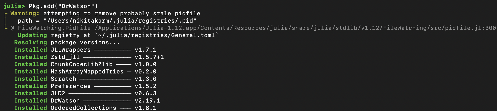{#fig-001 width=70%}

# Подготовка проекта

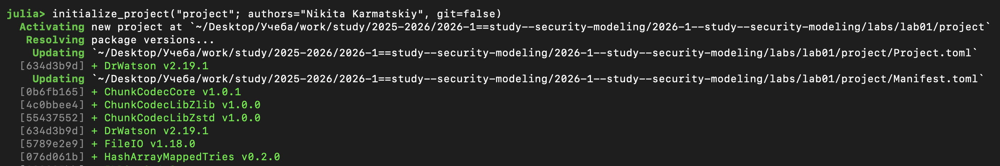{#fig-002 width=70%}

# Подготовка проекта

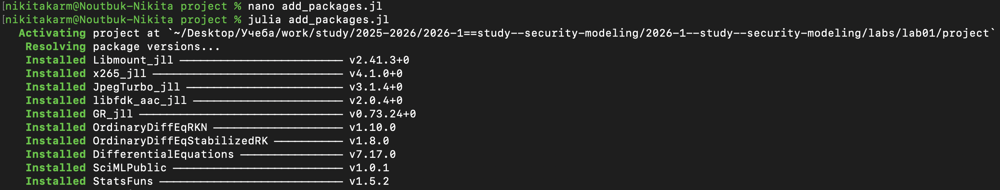{#fig-003 width=70%}

# Подготовка проекта

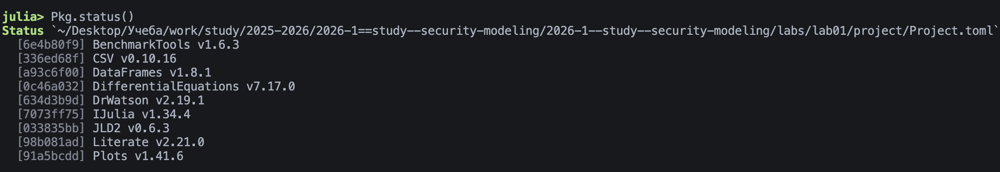{#fig-004 width=70%}

# Подготовка проекта

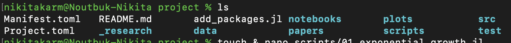{#fig-005 width=70%}

# Моделирование экспоненциального роста

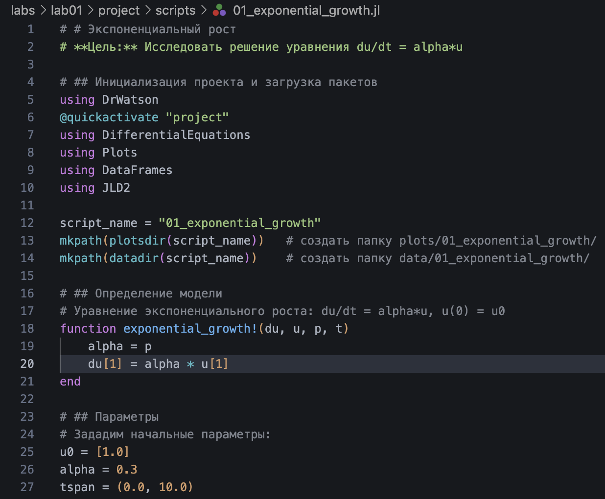{#fig-006 width=70%}

# Моделирование экспоненциального роста

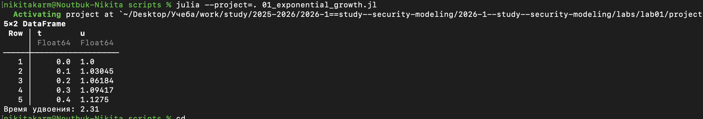{#fig-007 width=70%}

# Моделирование экспоненциального роста

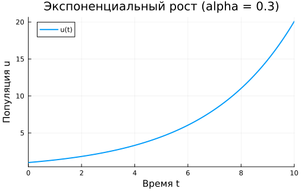{#fig-008 width=70%}

# Генерация производных форматов

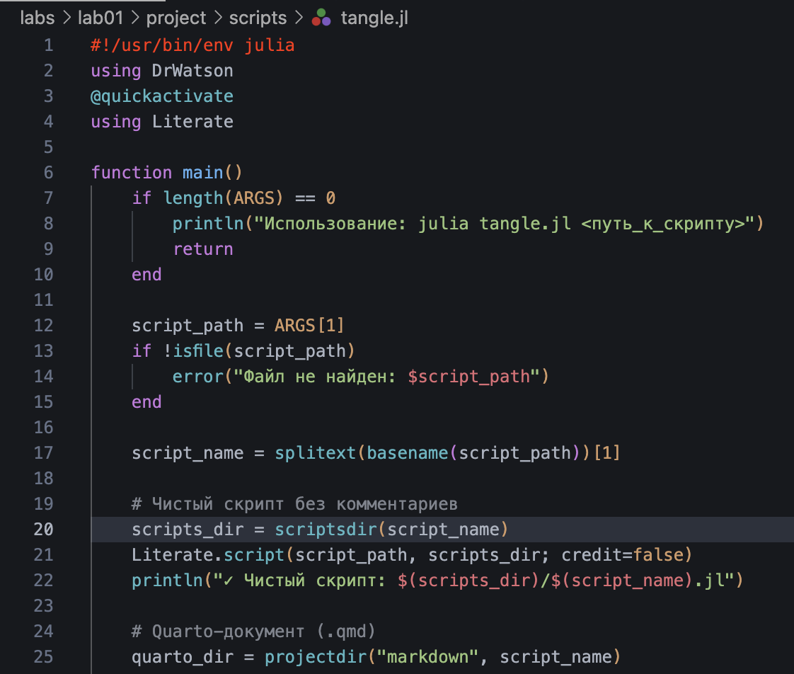{#fig-009 width=70%}

# Генерация производных форматов

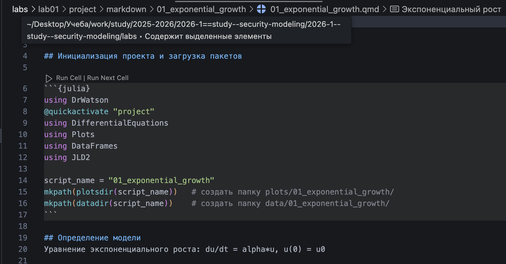{#fig-010 width=70%}

# Генерация производных форматов

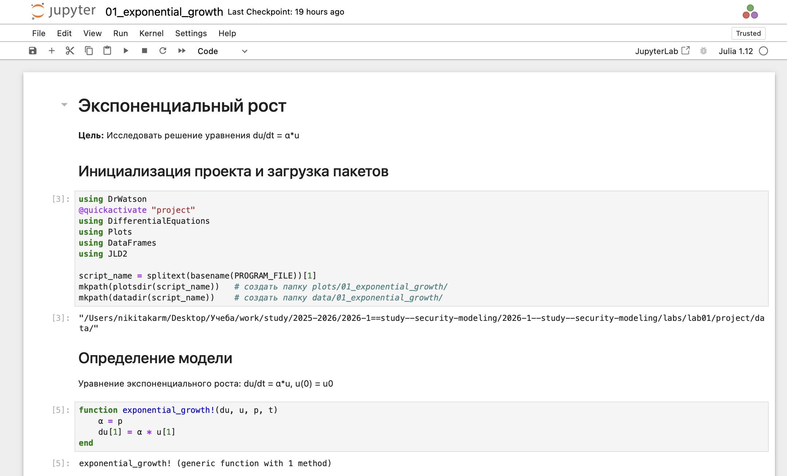{#fig-011 width=70%}

# Параметрическая версия модели

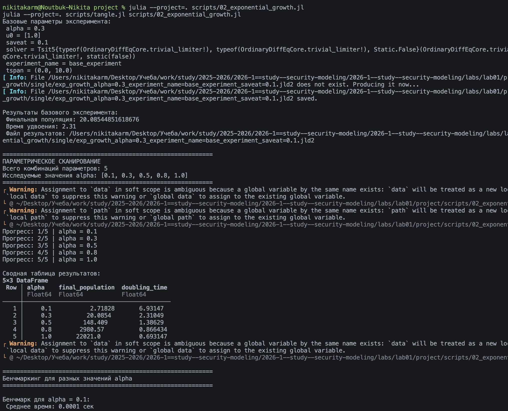{#fig-013 width=70%}

# Параметрическая версия модели

{#fig-013 width=70%}

# Параметрическая версия модели

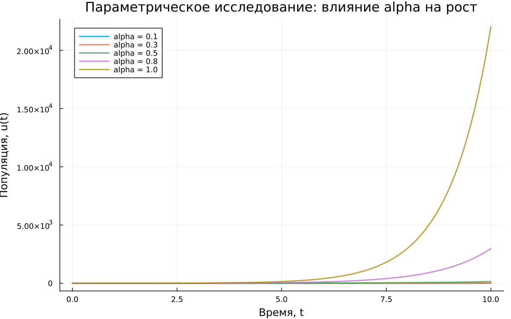{#fig-014 width=70%}

# Параметрическая версия модели

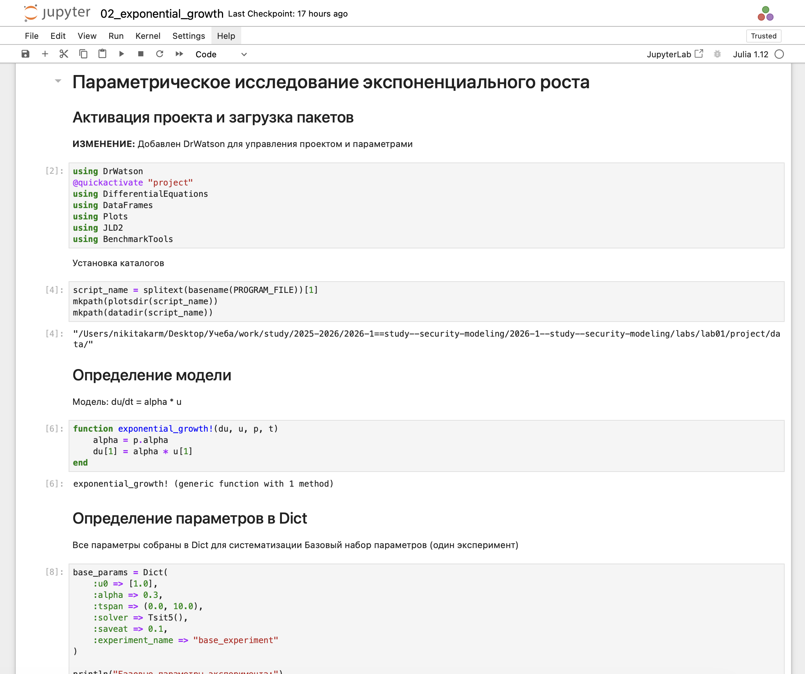{#fig-015 width=70%}

# Выводы

1. Создано рабочее пространство курса на основе пакета DrWatson с установленными зависимостями для математического моделирования.

2. Реализована модель экспоненциального роста в литературном стиле — код и документация совмещены в одном `.jl`-файле.

3. Из литературного кода автоматически сгенерированы три формата: чистый скрипт, Jupyter Notebook и документ Quarto.

4. Реализована параметризация расчётов — исследование модели при пяти различных значениях параметра α.

5. Итоговая документация объединяет код, результаты вычислений и аналитические выводы в едином воспроизводимом формате.

# Список литературы

