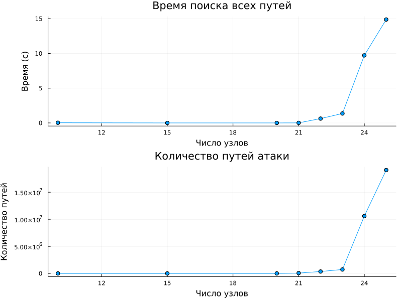
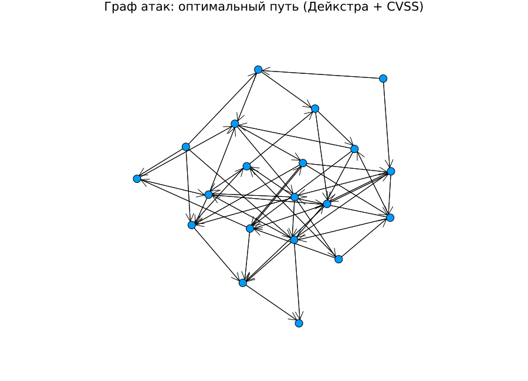
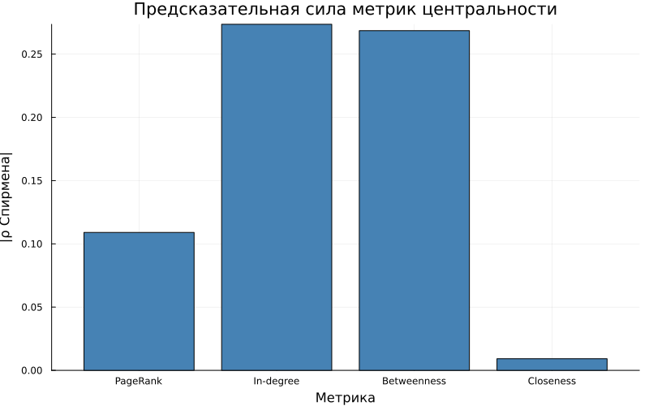
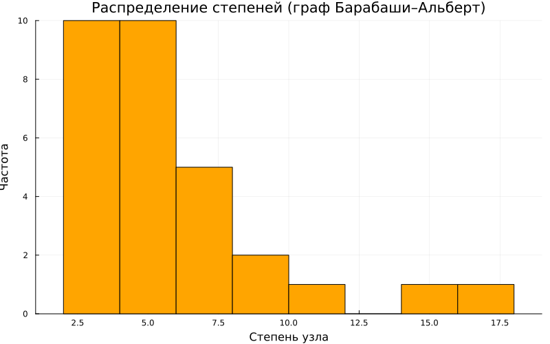
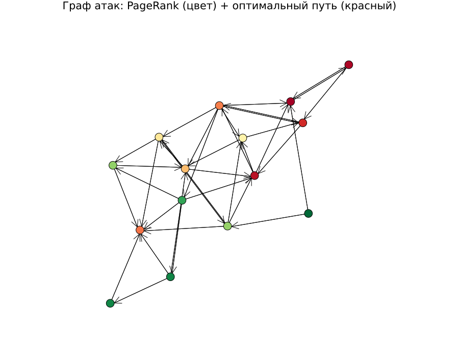
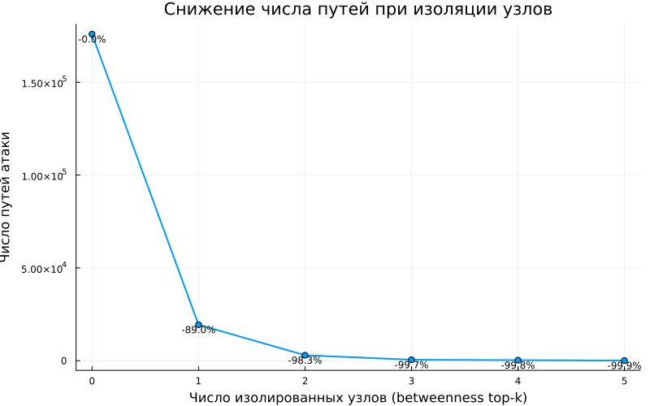

---
## Author
author:
  name: Кармацкий Никита Сергеевич
  degrees: MSc
  email: 1032259402@rudn.ru
  affiliation:
    - name: Российский университет дружбы народов
      country: Российская Федерация
      postal-code: 117198
      city: Москва
      address: ул. Миклухо-Маклая, д. 6
## Title
title: "Лабораторная работа №3"
subtitle: "Моделирование графов атак"
license: CC BY
date: today
date-format: "YYYY-MM-DD"
---

# Информация

## Докладчик

:::::::::::::: {.columns align=center}
::: {.column width="70%"}

  * Кармацкий Никита Сергеевич
  * студент группы НФИмд-01-25
  * Российский университет дружбы народов
  * [1032259402@rudn.ru](mailto:1032259402@rudn.ru)
  * <https://github.com/JerAndo4>

:::
::: {.column width="30%"}

:::
::::::::::::::

# Цель работы

- Освоить методы построения и анализа **графов атак** для оценки уязвимостей сетевой инфраструктуры
- Изучить:
  - представление сетевой топологии в виде ориентированного графа
  - алгоритмы поиска всех возможных путей атаки
  - расчёт метрик центральности для критических узлов
  - визуализацию графа с цветовой индикацией риска
  - оценку вероятности успешной атаки

# Задание

- Построить граф атак для заданной топологии сети
- Реализовать алгоритм поиска всех путей от источника к цели
- Рассчитать метрики центральности и выявить наиболее критичные узлы
- Визуализировать граф с цветовой шкалой риска
- Присвоить рёбрам веса (CVSS-вероятности) и найти наиболее вероятный путь

# Теоретическое введение

## Граф атак

**Граф атак** — ориентированный граф, в котором:

- **Вершины** — состояния системы или объекты сети (хосты, сервисы)
- **Рёбра** — переходы между состояниями при эксплуатации уязвимостей

Граф строится на основе:

- модели сети и топологии
- данных об уязвимостях (CVSS-оценок)
- доверительных отношений между узлами

## Ключевые алгоритмы

- **BFS** — поиск всех путей от источника к цели
- **Дейкстра** в пространстве $-\log p$ — наиболее вероятный путь
- **PageRank, betweenness, in-degree** — метрики центральности узлов

# Выполнение

## Граф атак с цветовой индикацией риска

{width=55%}

# Сходимость алгоритма поиска путей

{width=55%}

# Sweep по плотности рёбер

{width=55%}

# Дополнительные эксперименты

## CVSS + Дейкстра

{width=52%}

# Агентная модель распространения атаки

{width=55%}

# Сравнение метрик центральности

{width=55%}

# Граф Барабаши–Альберт

{width=55%}

# Расширенная визуализация

{width=52%}

# Эффективность защитных мер

{width=55%}

# Выводы

Разработана модель графа атак с полным анализом рисков:

- **Поиск путей**: BFS находит все маршруты от источника до цели
- **Метрики**: PageRank и betweenness определяют критические узлы
- **Вероятностная оценка**: Дейкстра в $-\log p$ пространстве
- **Агентная модель**: моделирование распространения атаки по шагам
- **Защитные меры**: изоляция top-betweenness узлов снижает число путей атаки
- **Граф Барабаши–Альберт**: степенное распределение как в реальных сетях
