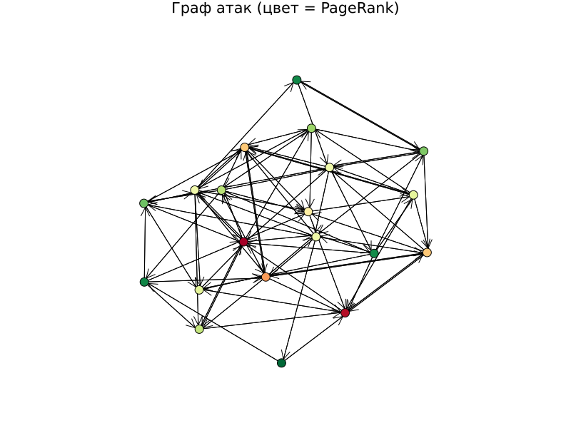
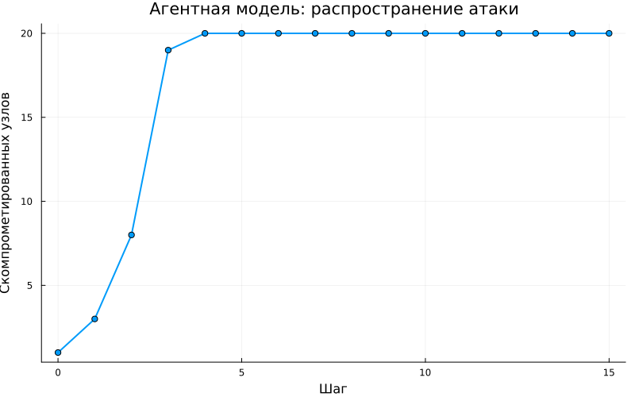

---
## Author
author:
  name: Кармацкий Никита Сергеевич
  degrees: MSc
  email: 1032259402@rudn.ru
  affiliation:
    - name: Российский университет дружбы народов
      country: Российская Федерация
      postal-code: 117198
      city: Москва
      address: ул. Миклухо-Маклая, д. 6

## Title
title: "Лабораторная работа №3"
subtitle: "Моделирование графов атак"
license: "CC BY"
---

# Цель работы

- Освоить методы построения и анализа графов атак для оценки уязвимостей сетевой инфраструктуры.
- На примере моделирования атак на корпоративную сеть изучить:
  - представление сетевой топологии и уязвимостей в виде ориентированного
  графа;
  - алгоритмы поиска всех возможных путей атаки от начальных точек до
  целевых активов;
  - расчёт метрик центральности для определения критических узлов;
  - визуализацию графа с цветовой индикацией уровня риска;
  - оценку вероятности успешной атаки с учётом сложности эксплуатации
  уязвимостей.

# Задание

- Построить граф атак для заданной топологии сети.
- Реализовать алгоритм поиска всех путей от заданного источника к цели.
- Рассчитать метрики центральности для всех узлов и выявить наиболее критичные.
- Визуализировать граф, раскрашивая узлы в зависимости от степени риска.
- Присвоить каждому ребру вес (вероятность успешной атаки) и вычислить наиболее вероятный путь атаки.

# Теоретическое введение
Julia — высокоуровневый свободный язык программирования с динамической типизацией, созданный для математических вычислений [@julialang]. Эффективен также и для написания программ общего назначения. Синтаксис языка схож с синтаксисом других математических языков, однако имеет некоторые существенные отличия.

**Граф атак** — это ориентированный граф, в котором вершины соответствуют состояниям системы или объектам сети (хостам, сервисам), а рёбра — переходам между состояниями, связанным с эксплуатацией уязвимостей. Граф строится на основе модели сети, данных об уязвимостях (CVSS-оценок) и топологии сети.

# Выполнение лабораторной работы

Для выполнения работы создан проект с помощью DrWatson. Основной модуль `src/attack_graph.jl` содержит все функции: построение ориентированного графа атак, поиск путей, расчёт метрик центральности, присвоение весов рёбрам и нахождение наиболее вероятного пути.

Скрипт `scripts/ag_run_experiment.jl` выполняет однократный запуск: строит граф атак для заданных параметров (20 узлов, вероятность ребра 0.2, CVSS-веса, доверительные отношения), находит все пути от узла 1 до узла 20, вычисляет метрики центральности и сохраняет результаты в JLD2-файл.

Скрипт `scripts/ag_analyze.jl` загружает сохранённые данные и строит визуализацию графа с цветовой шкалой PageRank: красный цвет соответствует высокому рангу (критичные узлы), зелёный — низкому ([рис. @fig-001]).

{#fig-001 width=70%}

Скрипт `scripts/ag_convergence.jl` исследует зависимость времени поиска всех путей и их количества от размера сети ([рис. @fig-002]).

{#fig-002 width=70%}

Скрипт `scripts/parameter_sweep.jl` систематически изучает влияние плотности рёбер на количество путей атаки, максимальную входящую степень и среднюю длину пути ([рис. @fig-003]).

{#fig-003 width=70%}

Скрипт `scripts/extra_tasks.jl` содержит шесть дополнительных экспериментов.

**1. CVSS + Дейкстра.** Граф атак с CVSS-оценками на рёбрах. Алгоритм Дейкстры в пространстве $-\log p$ выделяет наиболее вероятный путь ([рис. @fig-004]).

{#fig-004 width=70%}

**2. Агентная модель.** Вероятность компрометации узла $v$ равна $1 - \prod_{u \in N^-(v)} (1 - p_{u \to v})$. На рисунке показана динамика распространения атаки ([рис. @fig-005]).

{#fig-005 width=70%}

**3. Сравнение метрик центральности.** Ранговая корреляция Спирмена между частотой компрометации (50 прогонов) и метриками центральности позволяет выявить лучший предиктор уязвимости ([рис. @fig-006]).

{#fig-006 width=70%}

**4. Граф Барабаши–Альберт.** Моделирует безмасштабную сеть с предпочтительным присоединением; распределение степеней подчиняется степенному закону ([рис. @fig-007]).

{#fig-007 width=70%}

**5. Расширенная визуализация.** Цвет узла кодирует PageRank, толщина ребра и красный цвет выделяют оптимальный путь атаки ([рис. @fig-008]).

{#fig-008 width=70%}

**6. Защитные меры.** Изоляция узлов с наибольшей betweenness centrality: каждый изолированный узел снижает число путей атаки ([рис. @fig-009]).

{#fig-009 width=70%}

## Контрольные вопросы

**1. Граф атак** — это направленный граф, который представляет все возможные последовательности действий злоумышленника, приводящих к достижению цели. Вершины графа соответствуют состояниям системы или объектам (хостам, сервисам), а рёбра — переходам между состояниями, связанным с эксплуатацией уязвимостей.

**Графы атак используются для:**

- оценки уязвимости сети и анализа защищённости;
- выявления потенциальных маршрутов атак от точки проникновения до целевой системы;
- расчёта метрик опасности на основе CVSS-метрик, достижимости и других параметров;
- определения наиболее критичных уязвимостей и сценариев атак;
- анализа рисков и корреляции предупреждений IDS;
- расследования компьютерных инцидентов.

**2. Для поиска путей в графах атак применяются алгоритмы:**

- **BFS (поиск в ширину)** — находит кратчайший путь, исследуя вершины поуровнево.
- **Алгоритм Дейкстры** — на взвешенных графах находит путь с наибольшей вероятностью успеха через минимизацию $-\sum \log p_e$.
- **A\*** — расширение Дейкстры с эвристикой для ускорения поиска.
- **Беллмана–Форда** — подходит для графов с отрицательными весами.
- **Флойда–Уоршелла** — нахождение кратчайших путей между всеми парами вершин.

**3. Метрики центральности** определяют «важность» узла в графе:

- **In-degree** — количество входящих рёбер; высокое значение указывает на узел с множеством векторов атаки.
- **PageRank** — учитывает важность соседних узлов; высокий PageRank указывает на ключевые точки распространения угроз.
- **Betweenness** — доля кратчайших путей, проходящих через узел; определяет «узкие места» сети.
- **Closeness** — обратная средняя длина пути до всех остальных узлов.

**4. Вероятность успешной атаки** по пути оценивается через произведение весов рёбер: $P(\text{path}) = \prod_{e \in \text{path}} p_e$, где $p_e$ — вероятность успешной эксплуатации уязвимости на ребре $e$. Алгоритм Дейкстры в логарифмическом пространстве (минимизация $-\sum \log p_e$) находит путь с максимальной вероятностью.

**5. Ограничения модели графа атак:**

- **Масштабируемость**: число состояний и путей растёт экспоненциально с размером сети.
- **Неопределённость данных**: информация об уязвимостях часто неполна или неточна.
- **Динамичность**: реальные сети постоянно меняются, требуя регулярного обновления графа.
- **Циклические зависимости**: некоторые подходы (деревья атак) не поддерживают циклы.
- **Вычислительные ресурсы**: анализ больших графов ограничивает применение в реальном времени.

**6. Расширение модели для учёта защитных механизмов (межсетевых экранов):**

- Добавить узлы или рёбра, представляющие защитные меры; вес ребра отражает вероятность блокировки атаки.
- Использовать условные рёбра: ребро удаляется из графа, если соответствующий трафик блокируется МЭ.
- Применять вероятностные модели: присваивать вероятность обнаружения и блокировки атаки.
- Интегрировать данные о конфигурации защитных систем (правила доступа, сегменты сети).
- Использовать байесовские сети или сети Петри для динамического моделирования взаимодействия атак и защиты.











# Выводы

Разработана модель графа атак с анализом рисков для заданной сети:

- поиск всех путей от источника к цели (алгоритм BFS);
- оценка критичности узлов (метрики in-degree, PageRank, betweenness);
- визуализация рисков (цветовая схема: красный/жёлтый/зелёный по PageRank);
- расчёт наиболее вероятного пути атаки (веса рёбер = CVSS-вероятность успеха);
- агентная модель распространения атаки и анализ эффективности защитных мер.

# Список литературы{.unnumbered}

::: {#refs}
:::
