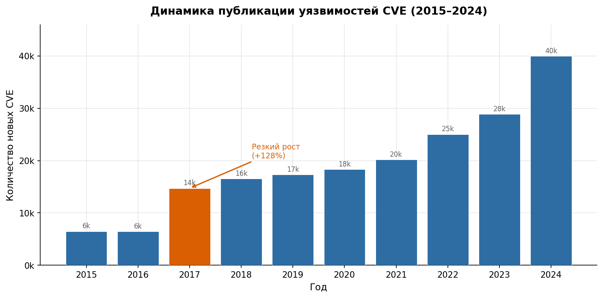
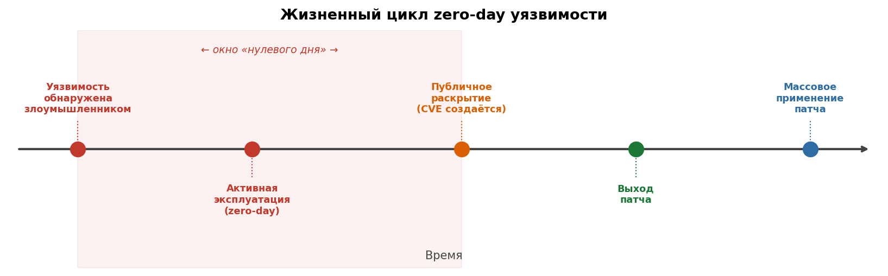
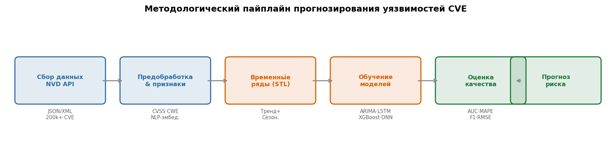

---
## Author
author:
  - name: Кармацкий Никита
    affiliation:
      - name: Российский университет дружбы народов им. П. Лумумбы
        country: Российская Федерация
        city: Москва
  - name: "Руководитель: д.ф.-м.н., проф. Кулябов Д.С."
    affiliation:
      - name: Кафедра теории вероятностей и кибербезопасности, РУДН
## Title
title: "Прогнозирование «zero-day» уязвимостей"
subtitle: "Методы машинного обучения на временны́х рядах CVE-данных"
license: "CC BY"
date: today
date-format: "YYYY-MM-DD"
---

# Информация

## Докладчик

:::::::::::::: {.columns align=center}
::: {.column width="70%"}

  * **Кармацкий Никита**
  * студент, направление «Информационная безопасность»
  * Российский университет дружбы народов им. П. Лумумбы

  **Научный руководитель:**

  * Кулябов Дмитрий Сергеевич
  * д.ф.-м.н., профессор
  * профессор кафедры теории вероятностей и кибербезопасности, РУДН

:::
::: {.column width="30%"}

:::
::::::::::::::

# Вводная часть

## Актуальность

:::::::::::::: {.columns align=center}
::: {.column width="48%"}

- Ежегодно публикуется **> 28 000 новых CVE** — ручная обработка невозможна
- **Zero-day** уязвимости эксплуатируются до выхода патча
- Лишь **2–7% CVE** реально эксплуатируются, но CVSS не позволяет их выделить
- Нужна **проактивная** приоритизация на основе данных

:::
::: {.column width="52%"}

:::
::::::::::::::

## Объект и предмет исследования

{width=95%}

:::::::::::::: {.columns align=top}
::: {.column width="50%"}
**Объект:** база данных CVE/NVD как источник структурированных временны́х рядов
:::
::: {.column width="50%"}
**Предмет:** методы МО для прогнозирования характеристик zero-day уязвимостей
:::
::::::::::::::

# Цель и задачи

## Цель, гипотеза и задачи

**Цель:** исследовать возможности применения методов МО для прогнозирования характеристик zero-day уязвимостей на данных CVE/NVD

**Гипотеза:** объединение временны́х паттернов CVE-данных с NLP-анализом описаний уязвимостей повышает точность прогнозирования по сравнению с однородными подходами

**Задачи:**

1. Систематизировать существующие методы МО для анализа CVE
2. Выявить временны́е паттерны в данных NVD (тренды, сезонность, аномалии)
3. Сравнить прогнозные модели: ARIMA, LSTM, градиентный бустинг, DNN, BERT
4. Оценить применимость подходов к специфике zero-day уязвимостей

# Материалы и методы

## Данные и инструменты

:::::::::::::: {.columns align=top}
::: {.column width="55%"}

**Источники данных**

- **NVD API** — 200 000+ CVE с 1999 года
- Метаданные: CVSS v3.1 (8 метрик), CWE, CPE
- Флаги эксплойтов: Exploit-DB, Metasploit

**Временны́е ряды CVE**

- Агрегация: неделя / месяц
- STL-декомпозиция: тренд + сезонность + остаток
- Лаговые признаки, скользящие средние

:::
::: {.column width="45%"}

**Инструменты**

- Python: pandas, scikit-learn, PyTorch
- statsmodels (ARIMA/SARIMA)
- transformers (BERT, SecureBERT)
- XGBoost / LightGBM

**Оценка качества**

- Регрессия: MAE, RMSE, MAPE
- Классификация: AUC-ROC, F1

:::
::::::::::::::

# Содержание исследования

## Сравнение методов МО для CVE

| Метод | Задача | Метрика |
|---|---|---|
| Градиентный бустинг (EPSS) | Вероятность эксплуатации | AUC > 0,80 |
| ARIMA / SARIMA | Прогноз объёмов CVE | Ошибка ~8% год. |
| BERT (CVSS-BERT) | Предсказание CVSS из текста | 83–96% точн. |
| SecureBERT + TF-IDF | CVSS + CWE совместно | Выше BERT |
| DNN | Паттерны zero-day | Выше SVM / RF |

: Сравнение подходов для анализа CVE-данных

## Этапы прогнозирования zero-day

{width=100%}

1. **Сбор** → **Предобработка** → **Временны́е ряды** → **Модели** → **Оценка** → **Прогноз риска**

# Результаты

## Ключевые результаты исследований

:::::::::::::: {.columns align=center}
::: {.column width="52%"}

:::
::: {.column width="48%"}

- **EPSS**: AUC > 0,80, устраняет ~93–98% «ложных приоритетов»
- **Объёмы CVE** прогнозируемы с ошибкой ~8% в год
- **BERT/SecureBERT**: точность CVSS-метрик 83–96%
- **DNN** точнее SVM/RF для zero-day паттернов

**Ограничение:** прямой прогноз конкретных zero-day невозможен

:::
::::::::::::::

# Заключение

## Выводы

1. CVE/NVD — богатый источник временны́х рядов для прогнозирования уязвимостей
2. МО-методы значительно превосходят статический CVSS для приоритизации угроз
3. Прямой прогноз zero-day невозможен; эффективны косвенные индикаторы и кластерный анализ
4. **Мультимодальные подходы** (временны́е ряды + NLP) — наиболее перспективное направление
5. **EPSS** (FIRST.org) — действующий промышленный пример успешного МО в кибербезопасности
