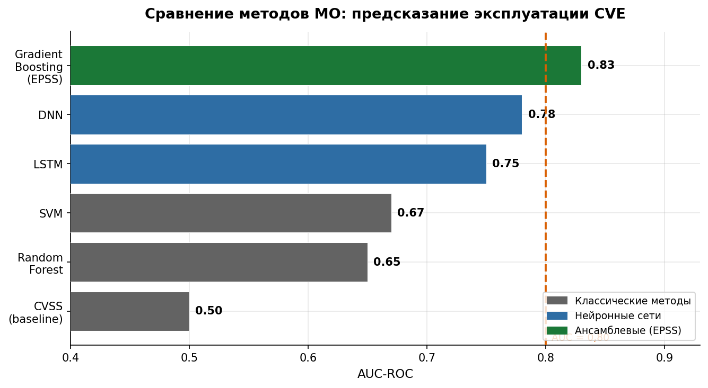

---
## Author
author:
  name: Кармацкий Никита
  affiliation:
    - name: Российский университет дружбы народов им. П. Лумумбы
      country: Российская Федерация
      postal-code: 117198
      city: Москва
      address: ул. Миклухо-Маклая, д. 6

## Title
title: "Прогнозирование появления «zero-day» уязвимостей с использованием методов машинного обучения на временных рядах данных об уязвимостях (CVE)"
subtitle: "Отчёт по теме научной презентации"
license: "CC BY"
---

# Цель работы

Исследование методов машинного обучения, применяемых для прогнозирования появления уязвимостей нулевого дня (zero-day) на основе анализа временных рядов данных из базы данных CVE (Common Vulnerabilities and Exposures).

# Задание

Изучить теоретические основы и практические подходы к прогнозированию zero-day уязвимостей с применением методов машинного обучения; проанализировать актуальные научные исследования по данной теме; систематизировать методологию применения анализа временных рядов к данным об уязвимостях CVE; оценить перспективы и ограничения существующих подходов.

# Теоретическое введение

## Уязвимости нулевого дня и база данных CVE

Уязвимость нулевого дня (zero-day vulnerability) — это программная брешь, неизвестная разработчику программного обеспечения или ещё не имеющая официального исправления на момент её обнаружения и активной эксплуатации злоумышленниками [@sharma_zeroday_dnn_2024]. Термин «нулевой день» означает, что у разработчика было ноль дней для разработки и распространения патча до начала атак. Подобные уязвимости представляют особую опасность, поскольку организации не имеют возможности защититься стандартными методами патч-менеджмента.

Основным стандартизированным реестром публично известных уязвимостей является система CVE (Common Vulnerabilities and Exposures), поддерживаемая организацией MITRE при финансовой поддержке Министерства внутренней безопасности США. Каждая запись CVE содержит уникальный идентификатор формата CVE-YYYY-NNNNN, текстовое описание уязвимости и ссылки на внешние источники. Расширенная база данных National Vulnerability Database (NVD) дополняет CVE-записи структурированными метаданными: вектором оценки серьёзности CVSS (Common Vulnerability Scoring System), классификацией типа уязвимости по стандарту CWE (Common Weakness Enumeration), а также перечнем затронутых программных продуктов в формате CPE.

Начиная с 2017 года ежегодный объём новых CVE превышает 15 000 записей, а к 2023 году достиг более 28 000 [@leverett_vuln_forecast_2022]. Такой масштаб делает ручную обработку и приоритизацию уязвимостей практически невозможной, что обусловливает необходимость автоматизированных методов анализа и прогнозирования (рис. [-@fig-cve-growth]).

{#fig-cve-growth width=90%}

## Временные ряды в контексте CVE-данных

Данные CVE естественным образом формируют временные ряды: каждая уязвимость публикуется с датой раскрытия, что позволяет анализировать динамику появления уязвимостей во времени. Временной ряд CVE может быть построен на различных уровнях агрегации:

- ежедневные, еженедельные или ежемесячные объёмы публикаций;
- ряды по отдельным производителям (вендорам) или программным продуктам;
- ряды по типам уязвимостей согласно классификации CWE;
- ряды по диапазонам оценок серьёзности CVSS.

Исследование [@leverett_vuln_forecast_2022] показало, что общие годовые объёмы CVE поддаются прогнозированию с точностью около 8%. Временные ряды для крупных вендоров с регулярными циклами раскрытия уязвимостей также демонстрируют предсказуемые паттерны, в то время как ряды для небольших производителей обладают высокой волатильностью.

Жизненный цикл zero-day уязвимости показан на рис. [-@fig-zeroday-timeline]: между реальным обнаружением уязвимости злоумышленником и её публичным раскрытием существует «окно нулевого дня», в течение которого атаки проводятся без возможности защиты патчем.

{#fig-zeroday-timeline width=95%}

Характерной особенностью CVE-данных является выраженная сезонность: многие вендоры придерживаются регулярных графиков публикации исправлений (например, «вторник исправлений» Microsoft, выпускаемый ежемесячно во второй вторник), что формирует периодические пики в временны́х рядах. Кроме того, в данных присутствуют долгосрочный тренд роста общего числа CVE и краткосрочные аномалии, связанные с обнаружением крупных уязвимостей (Heartbleed, Spectre/Meltdown, Log4Shell).

## Методы машинного обучения для прогнозирования уязвимостей

**Классические статистические методы.** Модели ARIMA (AutoRegressive Integrated Moving Average) и сезонный вариант SARIMA применяются для моделирования линейных зависимостей в CVE-данных. Они эффективны при стационарных рядах с выраженной сезонностью, однако не способны улавливать нелинейные взаимозависимости и внешние факторы (новые классы атак, смена вендорских политик раскрытия).

**Градиентный бустинг.** Система EPSS (Exploit Prediction Scoring System) [@jacobs_epss_2021] представляет наиболее успешный промышленный пример применения машинного обучения для анализа CVE. Модель на основе градиентного бустинга обучена на метаданных NVD, атрибутах CVSS и данных разведки угроз для предсказания вероятности эксплуатации каждой CVE в течение следующих 30 дней. Ключевой результат: только 2–7% опубликованных CVE когда-либо эксплуатируются на практике, тогда как CVSS-оценка не позволяет эффективно их идентифицировать. EPSS достиг значения AUC > 0,80, что существенно превосходит ранжирование по CVSS. Система поддерживается организацией FIRST.org и широко применяется в операционной безопасности.

**Глубокие нейронные сети (DNN).** Работа [@sharma_zeroday_dnn_2024] предлагает DNN-архитектуру для распознавания паттернов zero-day уязвимостей на основе векторов признаков из атрибутов CVSS, типа CWE, производителя и временно́й динамики. Глубокие нейронные сети превзошли классические методы (SVM, Random Forest) по качеству идентификации zero-day паттернов и позволяют проактивно выделять «зоны риска» — классы программных компонентов, наиболее вероятно содержащих неизвестные уязвимости.

**Методы обработки естественного языка (NLP).** Значительный объём информации об уязвимостях содержится в текстовых описаниях CVE. Модель CVSS-BERT [@shahid_cvssbert_2021] обучает отдельный BERT-классификатор для каждой из 8 метрик вектора CVSS, достигая точности 83–96% по отдельным метрикам. Система CVEDrill [@aghaei_cvedrill_2023] использует доменно-ориентированную модель SecureBERT в сочетании с TF-IDF для одновременного предсказания всех компонентов CVSS и классификации по иерархии CWE. Подход [@giannakopoulos_nlp_cve_2023] демонстрирует точность более 90% при сопоставлении CVE-описаний с категориями угроз.

**OSINT-расширенные методы.** Исследование [@kuhn_cvss_osint_2023] показало, что привлечение внешних текстовых источников — веб-страниц вендоров, технических блогов, журналов изменений, на которые ссылаются CVE-записи, — измеримо повышает точность предсказания CVSS по сравнению с использованием только текста CVE-описания. При этом не все источники одинаково полезны: качество и доступность ссылок существенно варьируется.

В таблице [-@tbl-methods-comparison] и на рис. [-@fig-model-comparison] приведено сравнение основных методов машинного обучения для анализа CVE.

| Метод | Тип входных данных | Задача | Ключевая работа | Метрика качества |
|---|---|---|---|---|
| Градиентный бустинг | Метаданные CVE, CVSS | Вероятность эксплуатации | [@jacobs_epss_2021] | AUC > 0,80 |
| ARIMA / SARIMA | Временно́й ряд CVE | Прогноз объёмов публикаций | [@leverett_vuln_forecast_2022] | Ошибка ~8% годовая |
| BERT (CVSS-BERT) | Текст описания CVE | Предсказание метрик CVSS | [@shahid_cvssbert_2021] | 83–96% точность |
| SecureBERT + TF-IDF | Текст CVE | CVSS + CWE совместно | [@aghaei_cvedrill_2023] | Выше generic BERT |
| DNN | Признаки CVE, временна́я динамика | Паттерны zero-day | [@sharma_zeroday_dnn_2024] | Выше SVM / RF |
| NLP-классификатор | Текст CVE | Категория угрозы | [@giannakopoulos_nlp_cve_2023] | > 90% точность |
| Linear SVC + TF-IDF | Текст CVE | Тип уязвимости (CWE) | [@yosifova_cve_type_2021] | Лучший из класс. МО |
| DL + OSINT | Текст CVE + веб-источники | Предсказание CVSS | [@kuhn_cvss_osint_2023] | Выше только CVE-текста |

: Сравнение методов машинного обучения для анализа CVE-данных {#tbl-methods-comparison}

{#fig-model-comparison width=85%}

## Специфика прогнозирования zero-day уязвимостей

Прямое прогнозирование конкретных zero-day уязвимостей принципиально невозможно по определению: до публичного раскрытия они отсутствуют в базе CVE, а значит, и в обучающей выборке модели. Практические подходы к решению задачи используют косвенные индикаторы и смежные постановки:

1. **Анализ латентного периода.** Моделируется временно́й промежуток между реальным обнаружением уязвимости злоумышленниками и её официальной публикацией в CVE/NVD. Исторические данные о задержках раскрытия позволяют оценить масштаб «теневого» множества неизвестных уязвимостей.

2. **Кластерный анализ исторических паттернов.** Исторические zero-day группируются по характеристикам затронутых компонентов, производителей, типов CWE и CVSS-метрик, что позволяет идентифицировать «зоны риска» — классы систем, наиболее подверженных будущим zero-day [@sharma_zeroday_dnn_2024].

3. **Прогнозирование вероятности эксплуатации.** EPSS [@jacobs_epss_2021] решает смежную задачу: предсказывает, какие из уже опубликованных CVE с наибольшей вероятностью будут эксплуатированы. Поскольку многие zero-day на момент публичного раскрытия уже активно используются, EPSS де-факто приближает оценку риска к нераскрытым уязвимостям.

4. **Прогноз объёмов по сегментам.** Временны́е ряды позволяют предсказывать не конкретные уязвимости, а объём и распределение будущих CVE по производителям, типам и уровням критичности [@leverett_vuln_forecast_2022], что поддерживает стратегическое планирование ресурсов безопасности.

# Содержание исследования

## Данные и признаки

Основным источником данных является NVD, предоставляющая CVE-записи в форматах JSON и XML через публичный API с 1999 года по настоящее время — более 200 000 записей. Ключевые признаки для построения временны́х рядов и обучения моделей:

- временна́я метка публикации (Published Date) и обновления (Last Modified Date);
- вектор CVSS v3.1 из 8 метрик: Attack Vector, Attack Complexity, Privileges Required, User Interaction, Scope, Confidentiality Impact, Integrity Impact, Availability Impact;
- базовая оценка CVSS (0,0–10,0) и уровень критичности (Low / Medium / High / Critical);
- классификация типа уязвимости по иерархии CWE;
- идентификаторы затронутых программных продуктов в формате CPE;
- флаги наличия публичных эксплойтов (Exploit-DB, Metasploit Framework).

## Методология прогнозирования

Общая методология исследования задачи прогнозирования zero-day уязвимостей на временны́х рядах CVE включает следующие этапы:

1. **Сбор и предобработка.** Выгрузка CVE-данных через NVD API, нормализация временны́х меток, обработка пропущенных значений, кодирование категориальных признаков (one-hot encoding для CWE, производителей).

2. **Построение временны́х рядов.** Агрегация записей по временны́м окнам (неделя, месяц); STL-декомпозиция (Seasonal-Trend decomposition using LOESS) на тренд, сезонность и остаток; проверка стационарности тестом Дики–Фуллера.

3. **Извлечение признаков.** Скользящие средние (MA-7, MA-30), лаговые признаки, признаки на основе компонентов CVSS-вектора, NLP-эмбеддинги текстовых описаний CVE (BERT, SecureBERT).

4. **Обучение и сравнение моделей.** Базовые модели: ARIMA / SARIMA (статистические); рекуррентные сети LSTM (долгосрочные зависимости); градиентный бустинг XGBoost / LightGBM (таблично-структурированные данные); глубокие нейронные сети DNN (сложные нелинейные зависимости).

Общая схема пайплайна представлена на рис. [-@fig-ml-pipeline].

{#fig-ml-pipeline width=100%}

5. **Оценка качества.** Для задач регрессии (прогноз объёмов): средняя абсолютная ошибка (MAE), среднеквадратичная ошибка (RMSE), средняя абсолютная процентная ошибка (MAPE). Для задач классификации (эксплуатируемая / неэксплуатируемая уязвимость): площадь под ROC-кривой (AUC-ROC) и F1-мера.

# Выводы

1. Данные CVE/NVD формируют богатые временны́е ряды, пригодные как для прогнозирования объёмов публикаций, так и для характеристики отдельных уязвимостей по многочисленным признакам.

2. Современные методы машинного обучения (градиентный бустинг, LSTM, DNN, BERT-архитектуры) значительно превосходят традиционный подход ранжирования по CVSS как по точности прогнозирования, так и по эффективности приоритизации уязвимостей.

3. Прямое прогнозирование конкретных zero-day уязвимостей принципиально невозможно; практические подходы используют косвенные индикаторы риска, кластерный анализ исторических паттернов и прогнозирование вероятности эксплуатации.

4. Перспективным направлением является объединение анализа временны́х рядов (динамика публикаций CVE) с NLP-анализом текстовых описаний уязвимостей в единой мультимодальной архитектуре.

5. Действующее промышленное внедрение EPSS (FIRST.org) подтверждает практическую значимость прогностических методов машинного обучения для операционной безопасности и управления уязвимостями.

# Список литературы{.unnumbered}

::: {#refs}
:::
